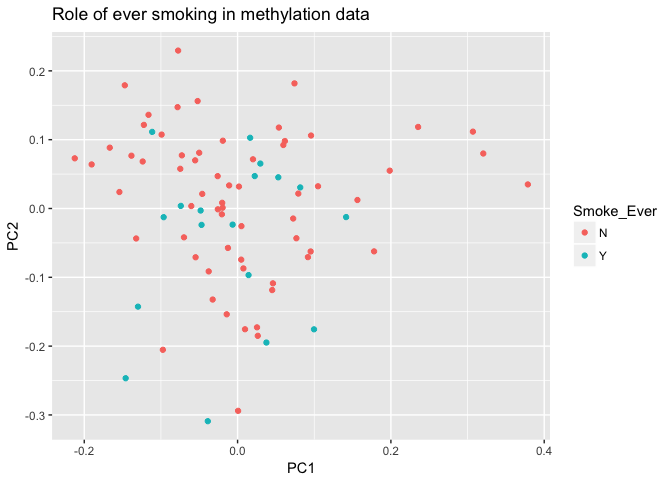

Quality Control of RNAseq and Methylation data
================
Emma Graham
March 15, 2017

Cleaning RNAseq data
====================

The normalized count table has been downloaded from the GEO repository. The methylation data will be extracted from the SOFT file using the GEOquery package.

This is an initial look at how control and asthma patients cluster, and how confounders affect patient groupings. 

``` r
setwd("../../")
library(GEOquery)
```

    ## Loading required package: Biobase

    ## Loading required package: BiocGenerics

    ## Loading required package: parallel

    ## 
    ## Attaching package: 'BiocGenerics'

    ## The following objects are masked from 'package:parallel':
    ## 
    ##     clusterApply, clusterApplyLB, clusterCall, clusterEvalQ,
    ##     clusterExport, clusterMap, parApply, parCapply, parLapply,
    ##     parLapplyLB, parRapply, parSapply, parSapplyLB

    ## The following objects are masked from 'package:stats':
    ## 
    ##     IQR, mad, xtabs

    ## The following objects are masked from 'package:base':
    ## 
    ##     anyDuplicated, append, as.data.frame, cbind, colnames,
    ##     do.call, duplicated, eval, evalq, Filter, Find, get, grep,
    ##     grepl, intersect, is.unsorted, lapply, lengths, Map, mapply,
    ##     match, mget, order, paste, pmax, pmax.int, pmin, pmin.int,
    ##     Position, rank, rbind, Reduce, rownames, sapply, setdiff,
    ##     sort, table, tapply, union, unique, unsplit

    ## Welcome to Bioconductor
    ## 
    ##     Vignettes contain introductory material; view with
    ##     'browseVignettes()'. To cite Bioconductor, see
    ##     'citation("Biobase")', and for packages 'citation("pkgname")'.

    ## Setting options('download.file.method.GEOquery'='auto')

    ## Setting options('GEOquery.inmemory.gpl'=FALSE)

``` r
library(tidyverse)
```

    ## Warning: package 'tidyverse' was built under R version 3.3.2

    ## Loading tidyverse: ggplot2
    ## Loading tidyverse: tibble
    ## Loading tidyverse: tidyr
    ## Loading tidyverse: readr
    ## Loading tidyverse: purrr
    ## Loading tidyverse: dplyr

    ## Warning: package 'ggplot2' was built under R version 3.3.2

    ## Warning: package 'tidyr' was built under R version 3.3.2

    ## Conflicts with tidy packages ----------------------------------------------

    ## combine():  dplyr, Biobase, BiocGenerics
    ## filter():   dplyr, stats
    ## lag():      dplyr, stats
    ## Position(): ggplot2, BiocGenerics, base

``` r
library(dtplyr)
library(DESeq2)
```

    ## Loading required package: S4Vectors

    ## Loading required package: stats4

    ## 
    ## Attaching package: 'S4Vectors'

    ## The following objects are masked from 'package:dplyr':
    ## 
    ##     first, rename

    ## The following object is masked from 'package:tidyr':
    ## 
    ##     expand

    ## The following objects are masked from 'package:base':
    ## 
    ##     colMeans, colSums, expand.grid, rowMeans, rowSums

    ## Loading required package: IRanges

    ## 
    ## Attaching package: 'IRanges'

    ## The following objects are masked from 'package:dplyr':
    ## 
    ##     collapse, desc, regroup, slice

    ## The following objects are masked from 'package:purrr':
    ## 
    ##     reduce, simplify

    ## Loading required package: GenomicRanges

    ## Loading required package: GenomeInfoDb

    ## Loading required package: SummarizedExperiment

``` r
library(reshape2)
```

    ## 
    ## Attaching package: 'reshape2'

    ## The following object is masked from 'package:tidyr':
    ## 
    ##     smiths

``` r
library(data.table)
```

    ## 
    ## Attaching package: 'data.table'

    ## The following objects are masked from 'package:reshape2':
    ## 
    ##     dcast, melt

    ## The following object is masked from 'package:SummarizedExperiment':
    ## 
    ##     shift

    ## The following object is masked from 'package:GenomicRanges':
    ## 
    ##     shift

    ## The following object is masked from 'package:IRanges':
    ## 
    ##     shift

    ## The following objects are masked from 'package:S4Vectors':
    ## 
    ##     first, second

    ## The following objects are masked from 'package:dplyr':
    ## 
    ##     between, first, last

    ## The following object is masked from 'package:purrr':
    ## 
    ##     transpose

``` r
#data <- getGEO(filename = "GSE85568.soft")

toy_data <- read.table(file = "../../Raw_Data/GSE85567_RNASeq_normalizedcounts.txt", header = TRUE, check.names = FALSE)
meta_data <- read.csv(file = "../../Raw_Data/GSE85566_metadata.txt", na.strings = c(".", ""))


#Some light data cleaning so that our labels of our meta data and toy data are the same. Arrange by gender
meta_data <- meta_data %>% arrange(Gender)

toy_data_names <- names(toy_data)

#remove patients in our meta data that we do not have RNAseq data for. 
meta_data <- meta_data %>% filter(ID %in% toy_data_names)
meta_data$Status <- relevel(meta_data$Status, ref = "Control")

(names_order <- as.character(meta_data$ID))
```

    ##  [1] "7ed8_4eff" "690e_45c3" "f9c8_4025" "f5d3_41dd" "15e4_4e17"
    ##  [6] "b65a_44b4" "8ebb_4e23" "a7d1_4fec" "78d1_4946" "dd18_4326"
    ## [11] "2d00_4023" "c3df_4109" "0447_47e4" "4c83_4965" "1c7d_4407"
    ## [16] "307c_4037" "86aa_4206" "1ca9_4a88" "8d5d_424a" "7bfd_4bf0"
    ## [21] "4ba3_4efe" "5e70_4f6c" "273e_4084" "ed81_42cb" "cf2d_4e5f"
    ## [26] "22ea_40a1" "ae28_4608" "1299_419b" "e380_4917" "fff9_43b1"
    ## [31] "2239_4ef1" "502d_4e7d" "ad5c_4ce5" "1ba9_4d79" "06f5_4503"
    ## [36] "6ebc_47ef" "b3c4_45a5" "53ff_4183" "74f3_4f8a" "3a8f_4120"
    ## [41] "3b7f_4689" "7a9e_4793" "39e9_4475" "8cd5_4d95" "86b9_4119"
    ## [46] "179c_43ec" "b75e_4b56" "acb6_4308" "a8b2_474d" "411a_4fba"
    ## [51] "d93e_43a4" "87f0_42ad" "3348_4c75" "36b7_4822" "f964_47ea"
    ## [56] "2cfc_42e1" "75cf_477a" "0610_40f0" "f0b3_4ef4" "b3ae_412f"
    ## [61] "3d3b_40f5" "2800_4691" "a6d0_4327" "e207_4fcd" "07f4_4e79"
    ## [66] "b9fb_4080" "f4fe_4560" "84e5_4094" "9c18_4eb2" "0d7e_4fec"
    ## [71] "9c8b_4a61" "fb20_4736" "efe7_4deb" "44df_487e" "e089_4cc0"
    ## [76] "6132_4c18" "767f_4e2a" "107e_4776" "154f_455f" "29ed_4409"
    ## [81] "cd0c_4cca" "1f64_4727" "e549_49d1" "bf1e_4b60" "5f2e_48a8"

``` r
toy_data <- toy_data %>% setcolorder(neworder = names_order )

#check that the order of sample names in our meta data file is the same as in our count table. 
colnames(toy_data) == names_order
```

    ##  [1] TRUE TRUE TRUE TRUE TRUE TRUE TRUE TRUE TRUE TRUE TRUE TRUE TRUE TRUE
    ## [15] TRUE TRUE TRUE TRUE TRUE TRUE TRUE TRUE TRUE TRUE TRUE TRUE TRUE TRUE
    ## [29] TRUE TRUE TRUE TRUE TRUE TRUE TRUE TRUE TRUE TRUE TRUE TRUE TRUE TRUE
    ## [43] TRUE TRUE TRUE TRUE TRUE TRUE TRUE TRUE TRUE TRUE TRUE TRUE TRUE TRUE
    ## [57] TRUE TRUE TRUE TRUE TRUE TRUE TRUE TRUE TRUE TRUE TRUE TRUE TRUE TRUE
    ## [71] TRUE TRUE TRUE TRUE TRUE TRUE TRUE TRUE TRUE TRUE TRUE TRUE TRUE TRUE
    ## [85] TRUE

``` r
#now we insert the data into the DESeqDataSet object using this fancy function from the DESeq2 package. We only look at samples we have complete metadata for. 

index <- complete.cases(meta_data)
dds <- DESeqDataSetFromMatrix(countData = toy_data[,index], colData = meta_data[index,], design = ~ 1)
vsd <- varianceStabilizingTransformation(dds, blind=FALSE)

#this function plots a PCA plot. 
PCAplotter <- function(variable, PC_one, PC_two){
    plot.new()
    data <- plotPCA(vsd, intgroup=c(variable), returnData=TRUE)
    percentVar <- round(100 * attr(data, "percentVar"))
    ggplot(data, aes_string(PC_one, PC_two, color=variable)) + 
        geom_point(size=3) + xlab(paste0("PC1: ",percentVar[1],"% variance")) + 
        ylab(paste0("PC2: ",percentVar[2],"% variance")) +
        ggtitle(paste0(c("PC1 and PC2 by", " ", variable), collapse = ""))
}

#In general, we are looking to see if our samples cluster based on known covariates. These trends will be confirmed by creating a linear model with covariates as variables and count as response variable. 
```

Now lets look at our plots.

``` r
#look at gender
PCAplotter("Gender", "PC1", "PC2")
```


``` r
#look at disease status
PCAplotter("Status", "PC1", "PC2")
```


``` r
#look at ethnicity
PCAplotter("Ethnicity", "PC1", "PC2")
```


``` r
#look at the effect of being a current smoker
PCAplotter("current_smoker", "PC1", "PC2")
```


``` r
#look at the effect of smoking ever
PCAplotter("Smoke_Ever", "PC1", "PC2")
```


``` r
#effect of smoking a certain range of packs per year
PCAplotter("smoke_pack_years_1", "PC1", "PC2")
```


Cleaning methylation data
=========================

``` r
setwd("../../src/1_data_inspect_&_4_diff met")

#Get methylation data
library(stringr)
```

    ## Warning: package 'stringr' was built under R version 3.3.2

``` r
library(ggfortify)
meth_dat <- getGEO(filename = "GSE85566_family.soft", getGPL = FALSE)
```

    ## Parsing....

    ## Found 116 entities...

    ## GPL13534 (1 of 116 entities)

    ## Warning in read.table(file = file, header = header, sep = sep, quote =
    ## quote, : not all columns named in 'colClasses' exist

    ## GSM2277217 (2 of 116 entities)

    ## Warning in read.table(file = file, header = header, sep = sep, quote =
    ## quote, : not all columns named in 'colClasses' exist

    ## GSM2277218 (3 of 116 entities)

    ## Warning in read.table(file = file, header = header, sep = sep, quote =
    ## quote, : not all columns named in 'colClasses' exist

    ## GSM2277219 (4 of 116 entities)

    ## Warning in read.table(file = file, header = header, sep = sep, quote =
    ## quote, : not all columns named in 'colClasses' exist

    ## GSM2277220 (5 of 116 entities)

    ## Warning in read.table(file = file, header = header, sep = sep, quote =
    ## quote, : not all columns named in 'colClasses' exist

    ## GSM2277222 (6 of 116 entities)

    ## Warning in read.table(file = file, header = header, sep = sep, quote =
    ## quote, : not all columns named in 'colClasses' exist

    ## GSM2277224 (7 of 116 entities)

    ## Warning in read.table(file = file, header = header, sep = sep, quote =
    ## quote, : not all columns named in 'colClasses' exist

    ## GSM2277226 (8 of 116 entities)

    ## Warning in read.table(file = file, header = header, sep = sep, quote =
    ## quote, : not all columns named in 'colClasses' exist

    ## GSM2277228 (9 of 116 entities)

    ## Warning in read.table(file = file, header = header, sep = sep, quote =
    ## quote, : not all columns named in 'colClasses' exist

    ## GSM2277231 (10 of 116 entities)

    ## Warning in read.table(file = file, header = header, sep = sep, quote =
    ## quote, : not all columns named in 'colClasses' exist

    ## GSM2277233 (11 of 116 entities)

    ## Warning in read.table(file = file, header = header, sep = sep, quote =
    ## quote, : not all columns named in 'colClasses' exist

    ## GSM2277235 (12 of 116 entities)

    ## Warning in read.table(file = file, header = header, sep = sep, quote =
    ## quote, : not all columns named in 'colClasses' exist

    ## GSM2277236 (13 of 116 entities)

    ## Warning in read.table(file = file, header = header, sep = sep, quote =
    ## quote, : not all columns named in 'colClasses' exist

    ## GSM2277237 (14 of 116 entities)

    ## Warning in read.table(file = file, header = header, sep = sep, quote =
    ## quote, : not all columns named in 'colClasses' exist

    ## GSM2277238 (15 of 116 entities)

    ## Warning in read.table(file = file, header = header, sep = sep, quote =
    ## quote, : not all columns named in 'colClasses' exist

    ## GSM2277239 (16 of 116 entities)

    ## Warning in read.table(file = file, header = header, sep = sep, quote =
    ## quote, : not all columns named in 'colClasses' exist

    ## GSM2277240 (17 of 116 entities)

    ## Warning in read.table(file = file, header = header, sep = sep, quote =
    ## quote, : not all columns named in 'colClasses' exist

    ## GSM2277241 (18 of 116 entities)

    ## Warning in read.table(file = file, header = header, sep = sep, quote =
    ## quote, : not all columns named in 'colClasses' exist

    ## GSM2277242 (19 of 116 entities)

    ## Warning in read.table(file = file, header = header, sep = sep, quote =
    ## quote, : not all columns named in 'colClasses' exist

    ## GSM2277243 (20 of 116 entities)

    ## Warning in read.table(file = file, header = header, sep = sep, quote =
    ## quote, : not all columns named in 'colClasses' exist

    ## GSM2277244 (21 of 116 entities)

    ## Warning in read.table(file = file, header = header, sep = sep, quote =
    ## quote, : not all columns named in 'colClasses' exist

    ## GSM2277245 (22 of 116 entities)

    ## Warning in read.table(file = file, header = header, sep = sep, quote =
    ## quote, : not all columns named in 'colClasses' exist

    ## GSM2277246 (23 of 116 entities)

    ## Warning in read.table(file = file, header = header, sep = sep, quote =
    ## quote, : not all columns named in 'colClasses' exist

    ## GSM2277247 (24 of 116 entities)

    ## Warning in read.table(file = file, header = header, sep = sep, quote =
    ## quote, : not all columns named in 'colClasses' exist

    ## GSM2277248 (25 of 116 entities)

    ## Warning in read.table(file = file, header = header, sep = sep, quote =
    ## quote, : not all columns named in 'colClasses' exist

    ## GSM2277249 (26 of 116 entities)

    ## Warning in read.table(file = file, header = header, sep = sep, quote =
    ## quote, : not all columns named in 'colClasses' exist

    ## GSM2277250 (27 of 116 entities)

    ## Warning in read.table(file = file, header = header, sep = sep, quote =
    ## quote, : not all columns named in 'colClasses' exist

    ## GSM2277251 (28 of 116 entities)

    ## Warning in read.table(file = file, header = header, sep = sep, quote =
    ## quote, : not all columns named in 'colClasses' exist

    ## GSM2277252 (29 of 116 entities)

    ## Warning in read.table(file = file, header = header, sep = sep, quote =
    ## quote, : not all columns named in 'colClasses' exist

    ## GSM2277253 (30 of 116 entities)

    ## Warning in read.table(file = file, header = header, sep = sep, quote =
    ## quote, : not all columns named in 'colClasses' exist

    ## GSM2277254 (31 of 116 entities)

    ## Warning in read.table(file = file, header = header, sep = sep, quote =
    ## quote, : not all columns named in 'colClasses' exist

    ## GSM2277255 (32 of 116 entities)

    ## Warning in read.table(file = file, header = header, sep = sep, quote =
    ## quote, : not all columns named in 'colClasses' exist

    ## GSM2277256 (33 of 116 entities)

    ## Warning in read.table(file = file, header = header, sep = sep, quote =
    ## quote, : not all columns named in 'colClasses' exist

    ## GSM2277257 (34 of 116 entities)

    ## Warning in read.table(file = file, header = header, sep = sep, quote =
    ## quote, : not all columns named in 'colClasses' exist

    ## GSM2277258 (35 of 116 entities)

    ## Warning in read.table(file = file, header = header, sep = sep, quote =
    ## quote, : not all columns named in 'colClasses' exist

    ## GSM2277259 (36 of 116 entities)

    ## Warning in read.table(file = file, header = header, sep = sep, quote =
    ## quote, : not all columns named in 'colClasses' exist

    ## GSM2277260 (37 of 116 entities)

    ## Warning in read.table(file = file, header = header, sep = sep, quote =
    ## quote, : not all columns named in 'colClasses' exist

    ## GSM2277261 (38 of 116 entities)

    ## Warning in read.table(file = file, header = header, sep = sep, quote =
    ## quote, : not all columns named in 'colClasses' exist

    ## GSM2277262 (39 of 116 entities)

    ## Warning in read.table(file = file, header = header, sep = sep, quote =
    ## quote, : not all columns named in 'colClasses' exist

    ## GSM2277263 (40 of 116 entities)

    ## Warning in read.table(file = file, header = header, sep = sep, quote =
    ## quote, : not all columns named in 'colClasses' exist

    ## GSM2277264 (41 of 116 entities)

    ## Warning in read.table(file = file, header = header, sep = sep, quote =
    ## quote, : not all columns named in 'colClasses' exist

    ## GSM2277265 (42 of 116 entities)

    ## Warning in read.table(file = file, header = header, sep = sep, quote =
    ## quote, : not all columns named in 'colClasses' exist

    ## GSM2277266 (43 of 116 entities)

    ## Warning in read.table(file = file, header = header, sep = sep, quote =
    ## quote, : not all columns named in 'colClasses' exist

    ## GSM2277267 (44 of 116 entities)

    ## Warning in read.table(file = file, header = header, sep = sep, quote =
    ## quote, : not all columns named in 'colClasses' exist

    ## GSM2277268 (45 of 116 entities)

    ## Warning in read.table(file = file, header = header, sep = sep, quote =
    ## quote, : not all columns named in 'colClasses' exist

    ## GSM2277269 (46 of 116 entities)

    ## Warning in read.table(file = file, header = header, sep = sep, quote =
    ## quote, : not all columns named in 'colClasses' exist

    ## GSM2277270 (47 of 116 entities)

    ## Warning in read.table(file = file, header = header, sep = sep, quote =
    ## quote, : not all columns named in 'colClasses' exist

    ## GSM2277271 (48 of 116 entities)

    ## Warning in read.table(file = file, header = header, sep = sep, quote =
    ## quote, : not all columns named in 'colClasses' exist

    ## GSM2277272 (49 of 116 entities)

    ## Warning in read.table(file = file, header = header, sep = sep, quote =
    ## quote, : not all columns named in 'colClasses' exist

    ## GSM2277273 (50 of 116 entities)

    ## Warning in read.table(file = file, header = header, sep = sep, quote =
    ## quote, : not all columns named in 'colClasses' exist

    ## GSM2277274 (51 of 116 entities)

    ## Warning in read.table(file = file, header = header, sep = sep, quote =
    ## quote, : not all columns named in 'colClasses' exist

    ## GSM2277275 (52 of 116 entities)

    ## Warning in read.table(file = file, header = header, sep = sep, quote =
    ## quote, : not all columns named in 'colClasses' exist

    ## GSM2277276 (53 of 116 entities)

    ## Warning in read.table(file = file, header = header, sep = sep, quote =
    ## quote, : not all columns named in 'colClasses' exist

    ## GSM2277277 (54 of 116 entities)

    ## Warning in read.table(file = file, header = header, sep = sep, quote =
    ## quote, : not all columns named in 'colClasses' exist

    ## GSM2277278 (55 of 116 entities)

    ## Warning in read.table(file = file, header = header, sep = sep, quote =
    ## quote, : not all columns named in 'colClasses' exist

    ## GSM2277279 (56 of 116 entities)

    ## Warning in read.table(file = file, header = header, sep = sep, quote =
    ## quote, : not all columns named in 'colClasses' exist

    ## GSM2277280 (57 of 116 entities)

    ## Warning in read.table(file = file, header = header, sep = sep, quote =
    ## quote, : not all columns named in 'colClasses' exist

    ## GSM2277281 (58 of 116 entities)

    ## Warning in read.table(file = file, header = header, sep = sep, quote =
    ## quote, : not all columns named in 'colClasses' exist

    ## GSM2277282 (59 of 116 entities)

    ## Warning in read.table(file = file, header = header, sep = sep, quote =
    ## quote, : not all columns named in 'colClasses' exist

    ## GSM2277283 (60 of 116 entities)

    ## Warning in read.table(file = file, header = header, sep = sep, quote =
    ## quote, : not all columns named in 'colClasses' exist

    ## GSM2277284 (61 of 116 entities)

    ## Warning in read.table(file = file, header = header, sep = sep, quote =
    ## quote, : not all columns named in 'colClasses' exist

    ## GSM2277285 (62 of 116 entities)

    ## Warning in read.table(file = file, header = header, sep = sep, quote =
    ## quote, : not all columns named in 'colClasses' exist

    ## GSM2277286 (63 of 116 entities)

    ## Warning in read.table(file = file, header = header, sep = sep, quote =
    ## quote, : not all columns named in 'colClasses' exist

    ## GSM2277287 (64 of 116 entities)

    ## Warning in read.table(file = file, header = header, sep = sep, quote =
    ## quote, : not all columns named in 'colClasses' exist

    ## GSM2277288 (65 of 116 entities)

    ## Warning in read.table(file = file, header = header, sep = sep, quote =
    ## quote, : not all columns named in 'colClasses' exist

    ## GSM2277289 (66 of 116 entities)

    ## Warning in read.table(file = file, header = header, sep = sep, quote =
    ## quote, : not all columns named in 'colClasses' exist

    ## GSM2277290 (67 of 116 entities)

    ## Warning in read.table(file = file, header = header, sep = sep, quote =
    ## quote, : not all columns named in 'colClasses' exist

    ## GSM2277291 (68 of 116 entities)

    ## Warning in read.table(file = file, header = header, sep = sep, quote =
    ## quote, : not all columns named in 'colClasses' exist

    ## GSM2277292 (69 of 116 entities)

    ## Warning in read.table(file = file, header = header, sep = sep, quote =
    ## quote, : not all columns named in 'colClasses' exist

    ## GSM2277293 (70 of 116 entities)

    ## Warning in read.table(file = file, header = header, sep = sep, quote =
    ## quote, : not all columns named in 'colClasses' exist

    ## GSM2277294 (71 of 116 entities)

    ## Warning in read.table(file = file, header = header, sep = sep, quote =
    ## quote, : not all columns named in 'colClasses' exist

    ## GSM2277295 (72 of 116 entities)

    ## Warning in read.table(file = file, header = header, sep = sep, quote =
    ## quote, : not all columns named in 'colClasses' exist

    ## GSM2277296 (73 of 116 entities)

    ## Warning in read.table(file = file, header = header, sep = sep, quote =
    ## quote, : not all columns named in 'colClasses' exist

    ## GSM2277297 (74 of 116 entities)

    ## Warning in read.table(file = file, header = header, sep = sep, quote =
    ## quote, : not all columns named in 'colClasses' exist

    ## GSM2277298 (75 of 116 entities)

    ## Warning in read.table(file = file, header = header, sep = sep, quote =
    ## quote, : not all columns named in 'colClasses' exist

    ## GSM2277299 (76 of 116 entities)

    ## Warning in read.table(file = file, header = header, sep = sep, quote =
    ## quote, : not all columns named in 'colClasses' exist

    ## GSM2277300 (77 of 116 entities)

    ## Warning in read.table(file = file, header = header, sep = sep, quote =
    ## quote, : not all columns named in 'colClasses' exist

    ## GSM2277301 (78 of 116 entities)

    ## Warning in read.table(file = file, header = header, sep = sep, quote =
    ## quote, : not all columns named in 'colClasses' exist

    ## GSM2277302 (79 of 116 entities)

    ## Warning in read.table(file = file, header = header, sep = sep, quote =
    ## quote, : not all columns named in 'colClasses' exist

    ## GSM2277303 (80 of 116 entities)

    ## Warning in read.table(file = file, header = header, sep = sep, quote =
    ## quote, : not all columns named in 'colClasses' exist

    ## GSM2277304 (81 of 116 entities)

    ## Warning in read.table(file = file, header = header, sep = sep, quote =
    ## quote, : not all columns named in 'colClasses' exist

    ## GSM2277305 (82 of 116 entities)

    ## Warning in read.table(file = file, header = header, sep = sep, quote =
    ## quote, : not all columns named in 'colClasses' exist

    ## GSM2277306 (83 of 116 entities)

    ## Warning in read.table(file = file, header = header, sep = sep, quote =
    ## quote, : not all columns named in 'colClasses' exist

    ## GSM2277307 (84 of 116 entities)

    ## Warning in read.table(file = file, header = header, sep = sep, quote =
    ## quote, : not all columns named in 'colClasses' exist

    ## GSM2277308 (85 of 116 entities)

    ## Warning in read.table(file = file, header = header, sep = sep, quote =
    ## quote, : not all columns named in 'colClasses' exist

    ## GSM2277309 (86 of 116 entities)

    ## Warning in read.table(file = file, header = header, sep = sep, quote =
    ## quote, : not all columns named in 'colClasses' exist

    ## GSM2277310 (87 of 116 entities)

    ## Warning in read.table(file = file, header = header, sep = sep, quote =
    ## quote, : not all columns named in 'colClasses' exist

    ## GSM2277311 (88 of 116 entities)

    ## Warning in read.table(file = file, header = header, sep = sep, quote =
    ## quote, : not all columns named in 'colClasses' exist

    ## GSM2277312 (89 of 116 entities)

    ## Warning in read.table(file = file, header = header, sep = sep, quote =
    ## quote, : not all columns named in 'colClasses' exist

    ## GSM2277313 (90 of 116 entities)

    ## Warning in read.table(file = file, header = header, sep = sep, quote =
    ## quote, : not all columns named in 'colClasses' exist

    ## GSM2277314 (91 of 116 entities)

    ## Warning in read.table(file = file, header = header, sep = sep, quote =
    ## quote, : not all columns named in 'colClasses' exist

    ## GSM2277315 (92 of 116 entities)

    ## Warning in read.table(file = file, header = header, sep = sep, quote =
    ## quote, : not all columns named in 'colClasses' exist

    ## GSM2277316 (93 of 116 entities)

    ## Warning in read.table(file = file, header = header, sep = sep, quote =
    ## quote, : not all columns named in 'colClasses' exist

    ## GSM2277317 (94 of 116 entities)

    ## Warning in read.table(file = file, header = header, sep = sep, quote =
    ## quote, : not all columns named in 'colClasses' exist

    ## GSM2277318 (95 of 116 entities)

    ## Warning in read.table(file = file, header = header, sep = sep, quote =
    ## quote, : not all columns named in 'colClasses' exist

    ## GSM2277319 (96 of 116 entities)

    ## Warning in read.table(file = file, header = header, sep = sep, quote =
    ## quote, : not all columns named in 'colClasses' exist

    ## GSM2277320 (97 of 116 entities)

    ## Warning in read.table(file = file, header = header, sep = sep, quote =
    ## quote, : not all columns named in 'colClasses' exist

    ## GSM2277321 (98 of 116 entities)

    ## Warning in read.table(file = file, header = header, sep = sep, quote =
    ## quote, : not all columns named in 'colClasses' exist

    ## GSM2277322 (99 of 116 entities)

    ## Warning in read.table(file = file, header = header, sep = sep, quote =
    ## quote, : not all columns named in 'colClasses' exist

    ## GSM2277323 (100 of 116 entities)

    ## Warning in read.table(file = file, header = header, sep = sep, quote =
    ## quote, : not all columns named in 'colClasses' exist

    ## GSM2277324 (101 of 116 entities)

    ## Warning in read.table(file = file, header = header, sep = sep, quote =
    ## quote, : not all columns named in 'colClasses' exist

    ## GSM2277325 (102 of 116 entities)

    ## Warning in read.table(file = file, header = header, sep = sep, quote =
    ## quote, : not all columns named in 'colClasses' exist

    ## GSM2277326 (103 of 116 entities)

    ## Warning in read.table(file = file, header = header, sep = sep, quote =
    ## quote, : not all columns named in 'colClasses' exist

    ## GSM2277327 (104 of 116 entities)

    ## Warning in read.table(file = file, header = header, sep = sep, quote =
    ## quote, : not all columns named in 'colClasses' exist

    ## GSM2277328 (105 of 116 entities)

    ## Warning in read.table(file = file, header = header, sep = sep, quote =
    ## quote, : not all columns named in 'colClasses' exist

    ## GSM2277329 (106 of 116 entities)

    ## Warning in read.table(file = file, header = header, sep = sep, quote =
    ## quote, : not all columns named in 'colClasses' exist

    ## GSM2277330 (107 of 116 entities)

    ## Warning in read.table(file = file, header = header, sep = sep, quote =
    ## quote, : not all columns named in 'colClasses' exist

    ## GSM2277331 (108 of 116 entities)

    ## Warning in read.table(file = file, header = header, sep = sep, quote =
    ## quote, : not all columns named in 'colClasses' exist

    ## GSM2277332 (109 of 116 entities)

    ## Warning in read.table(file = file, header = header, sep = sep, quote =
    ## quote, : not all columns named in 'colClasses' exist

    ## GSM2277333 (110 of 116 entities)

    ## Warning in read.table(file = file, header = header, sep = sep, quote =
    ## quote, : not all columns named in 'colClasses' exist

    ## GSM2277334 (111 of 116 entities)

    ## Warning in read.table(file = file, header = header, sep = sep, quote =
    ## quote, : not all columns named in 'colClasses' exist

    ## GSM2277335 (112 of 116 entities)

    ## Warning in read.table(file = file, header = header, sep = sep, quote =
    ## quote, : not all columns named in 'colClasses' exist

    ## GSM2277336 (113 of 116 entities)

    ## Warning in read.table(file = file, header = header, sep = sep, quote =
    ## quote, : not all columns named in 'colClasses' exist

    ## GSM2277337 (114 of 116 entities)

    ## Warning in read.table(file = file, header = header, sep = sep, quote =
    ## quote, : not all columns named in 'colClasses' exist

    ## GSM2277338 (115 of 116 entities)

    ## Warning in read.table(file = file, header = header, sep = sep, quote =
    ## quote, : not all columns named in 'colClasses' exist

    ## GSM2277339 (116 of 116 entities)

    ## Warning in read.table(file = file, header = header, sep = sep, quote =
    ## quote, : not all columns named in 'colClasses' exist

``` r
#save(meth_dat, file = "meth_dat.RData")
#meth_dat <- load("meth_dat.RData")

#now let's make a table of probe x sample

big_table <- data.frame(1:length(meth_dat@gsms[[1]]@dataTable@table$VALUE))

for (entry in 1:length(meth_dat@gsms)){
    big_table<- cbind(big_table, meth_dat@gsms[[entry]]@dataTable@table$VALUE)
}

big_table <- big_table[,-1]

all_sample_names <- c()
for (entry in 1:length(meth_dat@gsms)){
    sample_name <- str_sub(unlist(meth_dat@gsms[[entry]]@header$title), -9, -1)
    all_sample_names <- c(all_sample_names, sample_name)
}

names(big_table) <- all_sample_names

all(meth_dat@gsms[[1]]@dataTable@table$ID_REF == meth_dat@gsms[[2]]@dataTable@table$ID_REF)
```

    ## [1] TRUE

``` r
probe_names <- meth_dat@gsms[[1]]@dataTable@table$ID_REF

rownames(big_table) <- probe_names

meta_data <- meta_data %>% filter(ID %in% all_sample_names)

keep <- match(meta_data$ID, names(big_table))

big_table <- big_table %>% dplyr::select(keep)

#now includes 81 variables
all(names(big_table) == meta_data$ID)
```

    ## [1] TRUE

``` r
#add random constant to keep negative values from showing up. 

#
melted <- melt(big_table, value.name = "sample_values")
```

    ## No id variables; using all as measure variables

``` r
neg <- melted %>% filter(sample_values < 0)
head(neg)
```

    ##    variable sample_values
    ## 1 7ed8_4eff  -0.044794734
    ## 2 7ed8_4eff  -0.006851356
    ## 3 7ed8_4eff  -0.000219450
    ## 4 7ed8_4eff  -0.000556353
    ## 5 7ed8_4eff  -0.001765528
    ## 6 690e_45c3  -0.001813755

``` r
nrow(neg)
```

    ## [1] 644

``` r
#there are 644 negative values, which the DESeq holder does not like. So I will make them all positive by adding 1. 

non_int <- melted %>% filter(is.integer(sample_values) == FALSE)
big_table <- big_table + 1
#dds_meth <- DESeqDataSetFromMatrix(countData = big_table, colData = meta_data, design = ~ 1)
#vsd_meth <- varianceStabilizingTransformation(dds, blind=FALSE)
```

``` r
data <- prcomp(t(big_table))

#look at gender
autoplot(data, data = meta_data, colour = "Gender") + ggtitle("Role of Gender in methylation data")
```


``` r
autoplot(data, data = meta_data, colour = "Status") + ggtitle("Role of Disease status in methylation data")
```


``` r
#look at ethnicity
autoplot(data, data = meta_data, colour = "Ethnicity") + ggtitle("Role of Ethnicity in methylation data")
```


``` r
autoplot(data, data = meta_data, colour = "current_smoker") + ggtitle("Role of smoking in methylation data")
```


``` r
autoplot(data, data = meta_data, colour = "Smoke_Ever") + ggtitle("Role of ever smoking in methylation data")
```




``` r
#effect of smoking a certain range of packs per year
autoplot(data, data = meta_data, colour = "smoke_pack_years_1") + ggtitle("Methylation data as a function of how many packs per day is smoked")
```


