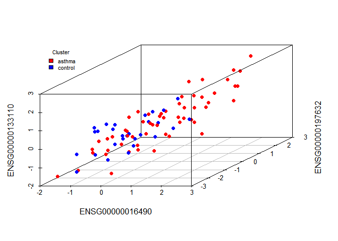

# K-means clustering
Allison Tai  
March 15, 2017  

First, we load all the packages we want to use.

```r
library(tidyverse)
library(WGCNA)
```

```
## ==========================================================================
## *
## *  Package WGCNA 1.51 loaded.
## *
## *    Important note: It appears that your system supports multi-threading,
## *    but it is not enabled within WGCNA in R. 
## *    To allow multi-threading within WGCNA with all available cores, use 
## *
## *          allowWGCNAThreads()
## *
## *    within R. Use disableWGCNAThreads() to disable threading if necessary.
## *    Alternatively, set the following environment variable on your system:
## *
## *          ALLOW_WGCNA_THREADS=<number_of_processors>
## *
## *    for example 
## *
## *          ALLOW_WGCNA_THREADS=4
## *
## *    To set the environment variable in linux bash shell, type 
## *
## *           export ALLOW_WGCNA_THREADS=4
## *
## *     before running R. Other operating systems or shells will
## *     have a similar command to achieve the same aim.
## *
## ==========================================================================
```

```r
library(magrittr)
library(scatterplot3d)
library(biomaRt)
options(stringsAsFactors = FALSE)
```

Now, we can load our data, the normalized RNA-seq read count data.

```r
countdata <- read.table(file= "../../data/raw_data/rna_seq_data/GSE85567_RNASeq_normalizedcounts.txt", check.names = FALSE)
metadata <- read.csv(file= "../../data/raw_data/rna_seq_data/GSE85566_metadata.txt", row.names = 1)

metadata %<>% filter(ID %in% colnames(countdata))
metadata %>% group_by(Status) %>% tally()
```

```
## # A tibble: 2 × 2
##    Status     n
##     <chr> <int>
## 1  Asthma    57
## 2 Control    28
```

```r
colnames(countdata) == metadata$ID
```

```
##  [1] FALSE FALSE FALSE FALSE FALSE FALSE FALSE FALSE FALSE FALSE FALSE
## [12] FALSE FALSE FALSE FALSE FALSE FALSE FALSE FALSE FALSE FALSE FALSE
## [23] FALSE FALSE FALSE FALSE FALSE FALSE FALSE FALSE FALSE FALSE FALSE
## [34] FALSE FALSE FALSE FALSE FALSE FALSE FALSE FALSE FALSE FALSE FALSE
## [45] FALSE FALSE FALSE FALSE FALSE FALSE FALSE FALSE FALSE FALSE FALSE
## [56] FALSE FALSE FALSE FALSE FALSE FALSE FALSE FALSE FALSE FALSE FALSE
## [67] FALSE FALSE FALSE FALSE FALSE FALSE FALSE FALSE FALSE FALSE FALSE
## [78] FALSE FALSE FALSE FALSE FALSE FALSE FALSE FALSE
```

```r
countdata <- countdata[,metadata$ID]
colnames(countdata) == metadata$ID
```

```
##  [1] TRUE TRUE TRUE TRUE TRUE TRUE TRUE TRUE TRUE TRUE TRUE TRUE TRUE TRUE
## [15] TRUE TRUE TRUE TRUE TRUE TRUE TRUE TRUE TRUE TRUE TRUE TRUE TRUE TRUE
## [29] TRUE TRUE TRUE TRUE TRUE TRUE TRUE TRUE TRUE TRUE TRUE TRUE TRUE TRUE
## [43] TRUE TRUE TRUE TRUE TRUE TRUE TRUE TRUE TRUE TRUE TRUE TRUE TRUE TRUE
## [57] TRUE TRUE TRUE TRUE TRUE TRUE TRUE TRUE TRUE TRUE TRUE TRUE TRUE TRUE
## [71] TRUE TRUE TRUE TRUE TRUE TRUE TRUE TRUE TRUE TRUE TRUE TRUE TRUE TRUE
## [85] TRUE
```
Extract the three relevant genes we wish to cluster on: CLCA1, serpinB2, and periostin, which multiple literature have used to distinguish between asthma endotypes, depending on whether the expression of the three are high (Th2-high) or low (Th2-low).  

```r
mart <- useDataset("hsapiens_gene_ensembl", useMart("ensembl"))
# time to grab the gene names to find our three genes
genes <- rownames(countdata)
geneList <- getBM(filters= "ensembl_gene_id", attributes= c("ensembl_gene_id",
"entrezgene", "description"),values=genes,mart= mart)
```
From looking through our list of genes, it looks like CLCA1 = ENSG00000016490, serpinB2 = ENSG00000197632, and periostin = ENSG00000133110.  

So, let's grab those rows, then fix up our data to get rid of biases, etc.

```r
# grab those rows
trundata <- countdata[c("ENSG00000016490", "ENSG00000197632", "ENSG00000133110"),]

# check to make sure data is okay
tcount <- as.data.frame(t(countdata))
gsg <- goodSamplesGenes(tcount, verbose = 1)
```

```
##  Flagging genes and samples with too many missing values...
##   ..step 1
```

```r
gsg$allOK # All are good. If not, will be False and we would have to filter them
```

```
## [1] TRUE
```

```r
# now work with our genes, take the log2 of count to prevent high count patients from skewing the clustering
ttrun <- as.data.frame(t(trundata))
ttrun <- log2(ttrun)

# replace -inf with 0, else scaling and centering will blow everything up
ttrun[ttrun == -Inf] <- 0

# center and scale our gene expression to reduce biases
ttrunSC <- data.frame(scale(ttrun))
```

Let's also take a look at how the expression profile of these three genes differ between asthma and control patients, as a check by drawing a 3D-plot.

```r
# load packages needed for plotting
library(scatterplot3d)

# define our colours
color <- metadata$Status
color[color == "Asthma"] <- "red"
color[color == "Control"] <- "blue"

# plot
attach(ttrunSC)
scatterplot3d(ENSG00000016490, ENSG00000197632, ENSG00000133110, color = color, pch=19)
legend("topleft", inset=.05,      # location and inset
    bty="n", cex=.7,              # suppress legend box, shrink text 50%
    title="Cluster",
    c("asthma", "control"), fill=c("red", "blue"))
```

<!-- -->

```r
detach(ttrunSC)
```
  
It looks like there are some asthma patients with higher expression in the three genes, and some with lower expression in the three genes (f), which have a similar expression profile to the control group.  This is not too surprising, as we know that the expression profiles of Th2-low asthma patients are more similar to controls than Th2-high asthma are too controls.  It's promising, because this  preliminary suggests this group of patients can be successively divided into separate endotypes.  

With this, we can cluster our asthma patients, to actually get defined groups each patient belongs to.

```r
# separate asthmatics and control into two matrices using our added column
matrixList <- split(ttrunSC, metadata$Status)

# now separate the patients and get ready to cluster
asthma <- data.frame(matrixList$Asthma)
control <- data.frame(matrixList$Control)

# run k-means, k = 2, 100 iterations, with 20 random sets to reduce the effects of randomization on the asthma patients
geneCluster = kmeans(asthma,2,100,nstart=20);

geneCluster$cluster <- as.factor(geneCluster$cluster)
sizeGrWindow(12,12)

# add clusters to metadata and save
metadata$cluster <- 0
for (i in 1:57) {
 x <- which(metadata$ID == rownames(asthma)[i])
  metadata[x, 9] = geneCluster$cluster[i]
}
write.csv(metadata, "metaCluster.csv")

# save some other things to avoid having to re-run k-means
write.table(asthma, file = "asthma.tsv")
write.table(control, file = "control.tsv")
```

Now let's draw some graphs and look at our clusters, using multiple 2D-scatterplots.  

```r
# reload packages needed for plotting, just in case
library(ggplot2)
library(gridExtra)
```

```
## Warning: package 'gridExtra' was built under R version 3.2.5
```

```
## 
## Attaching package: 'gridExtra'
```

```
## The following object is masked from 'package:dplyr':
## 
##     combine
```

```r
library(scatterplot3d)

# we're not going to re-generate our k-means clusters anymore, so run starting from here:
metadata <- read.csv('../../data/processed_data/metaCluster.csv', row.names = 1)
asthma <- read.table('../../data/processed_data/asthma.tsv')
control <- read.table('../../data/processed_data/control.tsv')

# CLCA1 = ENSG00000016490
# serpinB2 = ENSG00000197632
# periostin = ENSG00000133110

names(asthma)[names(asthma)=="ENSG00000016490"] <- "CLCA1"
names(asthma)[names(asthma)=="ENSG00000197632"] <- "SerpinB2"
names(asthma)[names(asthma)=="ENSG00000133110"] <- "Periostin"

# re-make the clusters, because I accidentally killed them earlier in the code
geneCluster <- data.frame(cluster = rep("", nrow(asthma)), stringsAsFactors = FALSE)
rownames(geneCluster) <- rownames(asthma)
for (i in 1:nrow(asthma)) {
  x <- which(metadata$ID == rownames(geneCluster)[i])
  if (metadata[x,9] == 1)
    geneCluster[i,1] = "Th2-high"
  else
    geneCluster[i,1] = "Th2-low"
}

# let's make some 2D plots
p1 <- ggplot(asthma, aes(CLCA1, SerpinB2, color = geneCluster$cluster)) + geom_point() + scale_colour_manual(values=c("#34675C", "#7DA3A1"), name = "Cluster")
p2 <- ggplot(asthma, aes(CLCA1, Periostin, color = geneCluster$cluster)) + geom_point() + scale_colour_manual(values=c("#34675C", "#7DA3A1"), name = "Cluster")
p3 <- ggplot(asthma, aes(SerpinB2, Periostin, color = geneCluster$cluster)) + geom_point() + scale_colour_manual(values=c("#34675C", "#7DA3A1"), name = "Cluster")
grid.arrange(p1, p2, p3, nrow = 3)
```

<!-- -->

```r
# save the image
# g <- arrangeGrob(p1, p2, p3, nrow=3) #generates g
# ggsave(file="k_means.png", g) #saves g
```
  
For this particular iteration of k-means, we get 28 patients in the first cluster, characterized by higher expression in the three genes, and 29 patients in the second, characterized by lower expression in the same genes.  We declared the first cluster Th2-high, and the second Th2-low, following previously published literature.  
  
Now let's look at our clusters with a 3D scatterplot, for more clarity.

```r
# set image resolution
# png("3d.png", width = 7, height = 7, units = 'in', res = 300)
attach(asthma)

# define colours for the clusters according to Arjun's hex codes
geneCluster$color[geneCluster$cluster == "Th2-high"] <- "#34675C"
geneCluster$color[geneCluster$cluster == "Th2-low"] <- "#7DA3A1"

# plot
scatterplot3d(CLCA1, SerpinB2, Periostin, color = geneCluster$color, pch=19, ylab = "")
legend("topleft", inset=.05,      # location and inset
    bty="n", cex=.7,              # suppress legend box, shrink text 50%
    title="Cluster",
    c("Th2-high", "Th2-low"), fill=c("#34675C", "#7DA3A1"))
text(x = 5, y = -1.8, "SerpinB2", srt = 25)
```

<!-- -->

```r
detach(asthma)
# save plot
# dev.off()
```
  
We can now see the two clusters much more clearly, and their division appears much more distinct as well.
