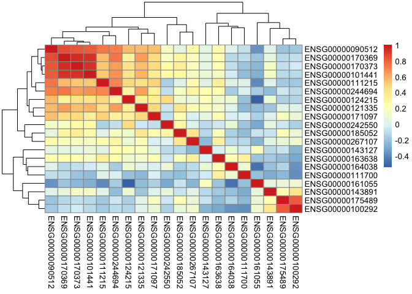
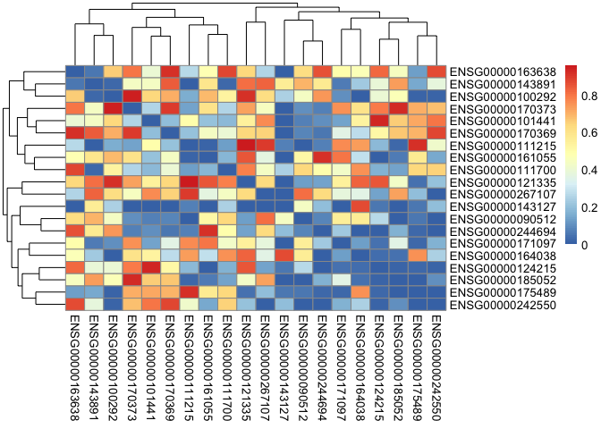

Differential Coexpression Analysis Demonstration
================
Eric Chu
2017-04-05

In this markdown document, I showcase the differential coexpression analysis. I will show the intermediate data produced as well as the final plots, some of which were included in our poster.

This markdown file sources two scripts that contain the actual code for the computation - [Differential Coexpression Analysis](https://github.com/STAT540-UBC/team_Undecided/blob/master/src/5_weighted_corr_net_&_diff_analysis/differential_correlation.r) and [Differential Coexpression Follow-Up Analysis](https://github.com/STAT540-UBC/team_Undecided/blob/master/src/5_weighted_corr_net_&_diff_analysis/diff_followup_analysis.r). In particular, the follow up analysis script provides an interface for interacting with the data. Please refer to those individual script files if you would like to know those details. No computation is done in this markdown file. This is only for showcasing our process.

Differential Coexpression Analysis
----------------------------------

The following script has been set up to run the differential correlation on twenty genes as an example. The call to source the script is commented out as the results have been written to [this directory]()

The result of the sourced script contain objects: networkMatrices, diffCorrelations, nullDiffCorrelations, and pValueMatrices. We wrote another script which provides an interface to interact with these data. See details below.

``` r
# imports
library(tidyverse)
```

    ## Warning: package 'tidyverse' was built under R version 3.3.2

    ## Loading tidyverse: ggplot2
    ## Loading tidyverse: tibble
    ## Loading tidyverse: tidyr
    ## Loading tidyverse: readr
    ## Loading tidyverse: purrr
    ## Loading tidyverse: dplyr

    ## Warning: package 'ggplot2' was built under R version 3.3.2

    ## Warning: package 'tidyr' was built under R version 3.3.2

    ## Conflicts with tidy packages ----------------------------------------------

    ## filter(): dplyr, stats
    ## lag():    dplyr, stats

``` r
library(dplyr)
library(pheatmap)

projectDirPath <- "/Users/ericchu/ws/team_Undecided/"

# source(paste0(projectDirPath, "src/5_weighted_corr_net_&_diff_analysis/differential_correlation.r")) 

# source the follow up analysis script in order to interact with the data produced by differential_correlation
source(paste0(projectDirPath, "src/5_weighted_corr_net_&_diff_analysis/diff_followup_analysis.r"))
```

    ## 
    ## Attaching package: 'combinat'

    ## The following object is masked from 'package:utils':
    ## 
    ##     combn

    ## 
    ## Attaching package: 'reshape2'

    ## The following object is masked from 'package:tidyr':
    ## 
    ##     smiths

    ## Warning: Missing column names filled in: 'X1' [1]

    ## Parsed with column specification:
    ## cols(
    ##   X1 = col_integer(),
    ##   ID = col_character(),
    ##   Status = col_character(),
    ##   Gender = col_character(),
    ##   Age = col_double(),
    ##   Ethnicity = col_character(),
    ##   current_smoker = col_character(),
    ##   Smoke_Ever = col_character(),
    ##   smoke_pack_years_1 = col_character(),
    ##   cluster = col_integer()
    ## )

    ## Joining, by = "sampleId"

### networkMatrices

The networkMatrices object contains the coexpression networks built from the 3 groups of samples that we have.

``` r
# show a subset
networkMatrices$control[1:3, 1:3]
```

    ##                 ENSG00000124215 ENSG00000143127 ENSG00000111215
    ## ENSG00000124215       1.0000000      0.23490980      0.48286862
    ## ENSG00000143127       0.2349098      1.00000000      0.04198592
    ## ENSG00000111215       0.4828686      0.04198592      1.00000000

``` r
# to visualize this better, see a heatmap constructed for the control group's coexpression matrix
pheatmap(networkMatrices$control)
```



### diffCorrelations

Next, we have the diffCorrelations object. This object contains the absolute difference taken from pairwise comparison of any two groups. In our case, there is a differential coexpression matrix for each of the following comparisons: control-th2high, control-th2low, th2high-th2low.

These matrices constitute our "observations" of coexpression changes.

``` r
diffCorrelations$control.th2high[1:3, 1:3]
```

    ##                 ENSG00000124215 ENSG00000143127 ENSG00000111215
    ## ENSG00000124215        0.000000        4.608167        11.94238
    ## ENSG00000143127        4.608167        0.000000        14.72260
    ## ENSG00000111215       11.942380       14.722596         0.00000

``` r
# again, we can plot a matrix for it for visualization
# here, we plot the absolute differential coexpression matrix control-th2high comparison
# note that the numbers are much higher than expected, this is beause the differential methylation weights have already been applied. This allows us to take differential methylation values into account. 
pheatmap(diffCorrelations$control.th2high)
```


### nullDiffCorrelations

In order to test for significance in the differentail coexpression analysis, we did a permutation test. This permutation test was done by randomly permuting the samples in the two group and then constructing and subtracting the resulting coexpression matrices. This process was repeated 1000 times to produce 1000 permutation values for each pair of genes. These 1000 values are then treated as the null distribution (the distribution produced by random chance). This allows us to estimate a p-value for each pair of genes. See [Differential Coexpression Analysis](https://github.com/STAT540-UBC/team_Undecided/blob/master/src/5_weighted_corr_net_&_diff_analysis/differential_correlation.r) for the actual computation. 

``` r
# here we show 5 permutations for each gene pair (only a subset)
nullDiffCorrelations$control.th2high[1:5, 1:3]
```

    ##                         gene_pair permutation_1 permutation_2
    ## 1 ENSG00000124215.ENSG00000124215      0.000000      0.000000
    ## 2 ENSG00000143127.ENSG00000124215      4.348352      4.334333
    ## 3 ENSG00000111215.ENSG00000124215     11.948011     11.715182
    ## 4 ENSG00000090512.ENSG00000124215     23.670978     23.579679
    ## 5 ENSG00000170373.ENSG00000124215      6.420174      6.168332

### pValueMatrices

Finally, the pValuesMatrices object contains the p-values estimated for every gene pair in every group comparison from the permutation tests.

``` r
pValueMatrices$control.th2high[1:3, 1:3]
```

    ##                 ENSG00000124215 ENSG00000143127 ENSG00000111215
    ## ENSG00000124215           0.000           0.054           0.186
    ## ENSG00000143127           0.054           0.000           0.068
    ## ENSG00000111215           0.186           0.068           0.000

``` r
# we can also visualize this in a heatmap (for control-th2high)
pheatmap(pValueMatrices$control.th2high)
```



Follow up analysis; pretty plots!
---------------------------------

Next I show some possible follow analysis that can be done on the resulting data from differential coexpression analysis. Some of these plots were included in our poster!

### P-value distributions!

The peak on the left shows the existence of a signal :D. This is only a toy example with 20 genes though. Our real analysis had 571 genes which had a much convincing plot. Please refer to our [poster](https://github.com/STAT540-UBC/team_Undecided/blob/master/docs/TeamUndecidedPoster.pdf).

``` r
# first lets look at the data produced; first 20
controlHighResults <- getDiffCorResults("control.th2high")
```

    ## Using rowname as id variables
    ## Using rowname as id variables

    ## Joining, by = "gene_pair"

``` r
controlHighResults %>% head(20)
```

    ##                          gene_pair abs_correlation_change p_value
    ## 1  ENSG00000244694.ENSG00000124215              3.0493563   0.000
    ## 2  ENSG00000170373.ENSG00000143127              9.4913132   0.000
    ## 3  ENSG00000121335.ENSG00000143127              4.9363048   0.000
    ## 4  ENSG00000185052.ENSG00000143127              4.2664724   0.000
    ## 5  ENSG00000171097.ENSG00000143127              5.5185635   0.000
    ## 6  ENSG00000170369.ENSG00000143127              4.1984206   0.000
    ## 7  ENSG00000163638.ENSG00000143127              8.2236500   0.000
    ## 8  ENSG00000161055.ENSG00000143127              7.4181602   0.000
    ## 9  ENSG00000267107.ENSG00000143127              4.0131036   0.000
    ## 10 ENSG00000090512.ENSG00000111215             34.1508325   0.000
    ## 11 ENSG00000185052.ENSG00000090512             23.2862865   0.000
    ## 12 ENSG00000175489.ENSG00000185052              3.2308907   0.000
    ## 13 ENSG00000164038.ENSG00000244694              6.3889820   0.000
    ## 14 ENSG00000242550.ENSG00000244694              2.3539472   0.000
    ## 15 ENSG00000161055.ENSG00000124215              4.4115898   0.002
    ## 16 ENSG00000101441.ENSG00000143127              4.1503979   0.002
    ## 17 ENSG00000242550.ENSG00000175489              2.9132025   0.003
    ## 18 ENSG00000267107.ENSG00000242550              0.5260046   0.003
    ## 19 ENSG00000143891.ENSG00000111215             12.3607539   0.008
    ## 20 ENSG00000242550.ENSG00000090512             23.3109259   0.009
    ##           fdr bonf
    ## 1  0.00000000 0.00
    ## 2  0.00000000 0.00
    ## 3  0.00000000 0.00
    ## 4  0.00000000 0.00
    ## 5  0.00000000 0.00
    ## 6  0.00000000 0.00
    ## 7  0.00000000 0.00
    ## 8  0.00000000 0.00
    ## 9  0.00000000 0.00
    ## 10 0.00000000 0.00
    ## 11 0.00000000 0.00
    ## 12 0.00000000 0.00
    ## 13 0.00000000 0.00
    ## 14 0.00000000 0.00
    ## 15 0.02375000 0.38
    ## 16 0.02375000 0.38
    ## 17 0.03166667 0.57
    ## 18 0.03166667 0.57
    ## 19 0.08000000 1.00
    ## 20 0.08142857 1.00

``` r
# visualizations
plotPValueDistribution("control.th2high")
```

    ## Using rowname as id variables

    ## `stat_bin()` using `bins = 30`. Pick better value with `binwidth`.


``` r
plotPValueDistribution("control.th2low")
```

    ## Using rowname as id variables
    ## `stat_bin()` using `bins = 30`. Pick better value with `binwidth`.


``` r
plotPValueDistribution("th2high.th2low")
```

    ## Using rowname as id variables
    ## `stat_bin()` using `bins = 30`. Pick better value with `binwidth`.


### Permutation distributions for specific gene pairs

Permutation tests were done to estimate p-value for each gene pair. The "null distribution" constructed by permutation can also be visualized. Here I show a few of those plots.

First, lets look at the significant gene pairs.

``` r
# lets look at the permutation distribution for the first gene on the list
(firstSigGene <- controlHighResults$gene_pair[1])
```

    ## [1] "ENSG00000244694.ENSG00000124215"

``` r
# none of the permuted values were more extreme than the observed value, therefore a p-value of 0
plotPermDistribution("control.th2high", firstSigGene)
```

    ## Using rowname as id variables
    ## Using rowname as id variables

    ## Using gene_pair as id variables


``` r
# second gene
(secondSigGene <- controlHighResults$gene_pair[2])
```

    ## [1] "ENSG00000170373.ENSG00000143127"

``` r
plotPermDistribution("control.th2high", secondSigGene)
```

    ## Using rowname as id variables

    ## Using rowname as id variables

    ## Using gene_pair as id variables


Next, lets look at something that's not so significant

``` r
# less significant genes
(firstInsigGene <- (controlHighResults %>% arrange(desc(p_value)))$gene_pair[5])
```

    ## [1] "ENSG00000163638.ENSG00000170369"

``` r
plotPermDistribution("control.th2high", firstInsigGene)
```

    ## Using rowname as id variables
    ## Using rowname as id variables

    ## Using gene_pair as id variables


``` r
# one more
(secondInsigGene <- (controlHighResults %>% arrange(desc(p_value)))$gene_pair[10])
```

    ## [1] "ENSG00000267107.ENSG00000111215"

``` r
plotPermDistribution("control.th2high", secondInsigGene)
```

    ## Using rowname as id variables

    ## Using rowname as id variables

    ## Using gene_pair as id variables


At this point, we have more than enough information to move onto the next stage in our pipeline, [network visualization](https://github.com/STAT540-UBC/team_Undecided/tree/master/src/6_network_visualization/networkFilter.md), which starts by processing the gene pair lists produced in this step (in the non-toy example, there were three, corresponding to control vs high, control vs low, and high vs low) into something usable for Cytoscape.  We'll return to this code to plot specific gene pairs, once Cytoscape has told us which gene pairs are the most interesting to look at!  

### Coexpressions between the two groups

Now that we know which genes to look at, another cool plot we have is the expression correlation plots! We can visualize the differences between the two groups by plotting 2 different lines :D


Let's try plotting the expression correlations between genes that had significant differential coexpression. (same gene pairs from before)

``` r
plotExpressionCorrelations("control.th2high", firstSigGene)
```

    ## Joining, by = "sampleId"


``` r
plotExpressionCorrelations("control.th2high", secondSigGene)
```

    ## Joining, by = "sampleId"


And.. insigificant gene pairs!

``` r
plotExpressionCorrelations("control.th2high", firstInsigGene)
```

    ## Joining, by = "sampleId"


``` r
plotExpressionCorrelations("control.th2high", secondInsigGene)
```

    ## Joining, by = "sampleId"


Lastly, keep in mind that what's presented here is only a toy example with 20 genes. Our full analysis has 1000 genes. Please refer to our [results](https://github.com/STAT540-UBC/team_Undecided/blob/master/results/results.md) for the proper details. We only put together this markdown document for the purpose of demonstrating our differential coexpression analyss. 

Thanks for reading!! :)

For a bonus stage that didn't appear on our poster, but was deemed important enough to place here in our pipeline, please head to [pathway enrichment](https://github.com/STAT540-UBC/team_Undecided/blob/master/src/7_pathway_enrichment/PathwayEnrichment.Rmd).