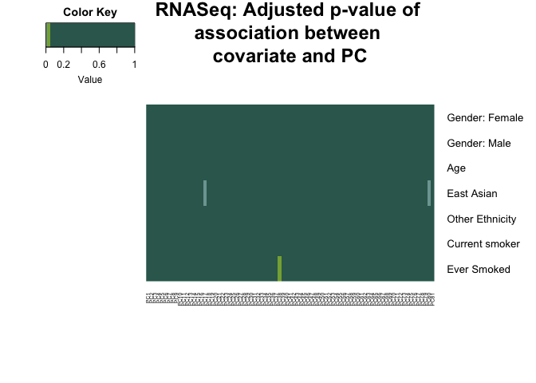

Exploration of Methylation and RNAseq data
================
Emma Graham
March 25, 2017

In this document, I will clean the normalized read counts and Illumina 450k methylation array data provided by Nicodemus-Johnson et al (2016).

Below, I will go through the data cleaning steps the authors performed, as well as the quality control steps that I will perform.

**Illumina Hi-Seq 2000 data** - AUTHORS PERFORMED: - aligned reads to human genome using BWA - isolated protein coding genes using BedTools - adjusted counts for gene length and read depth (unclear how this was done) - filtered to genes that had at least 5 reads in 2 individuals, and that were annotated in Biomart - RUVseq was used to find hidden sources of variation (using spike-ins). One RUV was correlated with RIN and another one with ethnicity, average base pair read length and flow cell - Two RUVs were regressed out, PCs were not correlated with additional variables

-   WILL PERFORM:
    -   check that PCs are not significantly correlated with known coundounders

**Illumina 450k Array Methylation data** - AUTHORS PERFORMED: - discarded lowly detected probes, probes that mapped to more than one site and probes that overlapped with known SNPs - SWAN algorithm in Minfi package to correct Type I and Type II probe bias - regressed out effects of Chip using COMBAT - included gender, ethnicity and age as covariates in differential expression (BMI was not included)

-   WILL PERFORM:
    -   check distribution of Beta values to see if bimodal
    -   check association of each PC with confounders
    -   remove non-variable CpGs, through procedure defined by Edgar et al (2017)

--

Set global settings so all warning messages are suppressed.

Load all necessary packages and data.

``` r
library(tidyverse)
library(limma)
library(gplots)
library(RColorBrewer)
library(RCurl)
library(lumi)
library(limma)
library(biomaRt)
setwd("~/Desktop/Masters/STAT540/Team_Undecided")
rna_data <- read.table(file = "data/raw_Data/GSE85567_RNASeq_normalizedcounts.txt", 
                                             header = TRUE,
                                             row.names = 1, 
                                             check.names = FALSE)

#RNA data has 16535 rows and 85 columns. 
dim(rna_data)
```

    ## [1] 16535    85

``` r
#next we will load the methylation data. It is really big so I saved it in 11 smaller files (github won't allow me to push anything larger than 50MB)
meth_data <- c()
methylation_files <- list.files("data/raw_Data/Methylation_Data", full.names = TRUE)
for (entry in 1:11){
    data <- read.table(file = methylation_files[entry], 
                                         header = TRUE, 
                                         check.names = FALSE, 
                                         row.names = 1)
    meth_data <- rbind(meth_data, data)
}

stuff <- rownames(meth_data)
length(stuff)
```

    ## [1] 327271

``` r
#check to see that no row was imported twice. 
stuffunique <- length(unique(stuff))
#there seem to be the same number of rows in the unique names vector than in the rownames vector. Therefore there are no repeats!

#let's see how many columns are in the methylation data. There are 115 columns, so we will need to find the overlap between the methylation and RNAseq data. 
dim(meth_data)
```

    ## [1] 327271    115

``` r
#Read in the meta data file that allison generated, with the Cluster identities. We exclude the snoke_pack_1year column because I have no idea what it means, and there's missing data. 
meta_data <- read.table("data/processed_data/metaCluster.csv", header = TRUE, row.names = 1, sep = ",")[,-c(8)]

#See the dimensions of the matrix. There are 85 rows, each of which corresponds to the RNAseq data. 
dim(meta_data)
```

    ## [1] 85  8

Now we want to find the overlap between the RNAseq and methylation data.

``` r
keep_samples <- colnames(rna_data)
overlap_rna_meth <- intersect(colnames(meth_data), keep_samples)
#81 samples overlap between the methylation and RNA data

#remove samples that are not common
common_meth <- meth_data[, c(overlap_rna_meth)]
common_rna <- rna_data[, c(overlap_rna_meth)]

#remove samples that are not in the overlap from the meta data file
meta_data <- meta_data %>% filter(ID %in% overlap_rna_meth)

#perform some factor reordering so that when we do differential analysis, our results make sense.
meta_data <- data.frame(meta_data, row.names = 1)
meta_data$current_smoker <- droplevels(meta_data$current_smoker)
meta_data$Smoke_Ever <- droplevels(meta_data$Smoke_Ever)
meta_data$cluster <- as.factor(meta_data$cluster)
meta_data$cluster <- relevel(meta_data$cluster, ref = "0")

#sort the rows of the meta data table in some consistent way. 
meta_data <- meta_data[sort(rownames(meta_data)),]

#apply this ordering to RNA data
common_rna <- common_rna[, sort(rownames(meta_data))]
#and to methylation
common_meth <- common_meth[, sort(rownames(meta_data))]

#check that the columns of RNA data are equal to the columns of methylation data
all(colnames(common_rna) == colnames(common_meth))
```

    ## [1] TRUE

``` r
#check that the columns of RNA data are equal to the rows of meta data
all(colnames(common_rna) == rownames(meta_data))
```

    ## [1] TRUE

RNA-seq: confirming that PCs do not correlate with covariates
-------------------------------------------------------------

Now let's use limma to see if any covariates listed in the meta data file are strongly associated with the principal components.

``` r
#isolate PCs
pcs_rna <- t(prcomp(log2(2+t(common_rna)), center = TRUE, scale = TRUE)[["x"]])

#define design matrix
design_matrix <- model.matrix(~ 0 + Gender + Age + Ethnicity + current_smoker + Smoke_Ever, meta_data)

#run limma
full_fit <- lmFit(pcs_rna, design_matrix)
full_EbFit <- eBayes(full_fit)
colnames(full_EbFit)
```

    ## [1] "GenderFemale"    "GenderMale"      "Age"             "EthnicityEA"    
    ## [5] "EthnicityOther"  "current_smokerY" "Smoke_EverY"

``` r
#isolate p-values for association of each pc with the covariates
big_table <- matrix(ncol = 81)
for (entry in 1:length(colnames(full_EbFit))){
    pval <- toptable(full_EbFit, coef = entry, number = Inf, sort.by = "none")$adj.P.Val
    big_table <- rbind(big_table, pval)
}

#remove empty first row
big_table <- big_table[-c(1),]
#grab PC names
row_pc_names <- rownames(toptable(full_EbFit, coef = entry, number = Inf, sort.by = "none"))
colnames(big_table) <- row_pc_names
rownames(big_table) <- c("Gender: Female", "Gender: Male", "Age", "East Asian", "Other Ethnicity", "Current smoker", "Ever Smoked" )
cols<-c("#7DA3A1","#86AC41", "#34675C" )
heatmap.2(big_table,  Rowv = NA, Colv = NA, scale = NULL , trace="none",  dendrogram = "none",
          col=cols, cexCol=0.5, cexRow=1 , margins= c (8,8), srtCol=90 , symm = FALSE,
                    breaks = c(0, 0.01, 0.05, 1),
                    density.info = "none",
          main = "RNASeq: Adjusted p-value of \nassociation between \ncovariate and PC" )
```



Since these associations are mainly in either middling or late PCs, we will not adjust for them. However, it should be noted that this association was not reported in the manuscript!

Methylation data: association with confounders
----------------------------------------------

``` r
#isolate PCs
pcs_meth <- t(prcomp(log2(2+t(common_meth)), center = TRUE, scale = TRUE)[["x"]])

#define design matrix
design_matrix <- model.matrix(~ 0 + Gender + Age + Ethnicity + current_smoker + Smoke_Ever, meta_data)

#run limma
full_fit <- lmFit(pcs_meth, design_matrix)
full_EbFit <- eBayes(full_fit)
colnames(full_EbFit)
```

    ## [1] "GenderFemale"    "GenderMale"      "Age"             "EthnicityEA"    
    ## [5] "EthnicityOther"  "current_smokerY" "Smoke_EverY"

``` r
#isolate p-values for association of each pc with the covariates
big_table <- matrix(ncol = 81)
for (entry in 1:length(colnames(full_EbFit))){
    pval <- toptable(full_EbFit, coef = entry, number = Inf, sort.by = "none")$adj.P.Val
    big_table <- rbind(big_table, pval)
}

#remove empty first row
big_table <- big_table[-c(1),]
#grab PC names
row_pc_names <- rownames(toptable(full_EbFit, coef = entry, number = Inf, sort.by = "none"))
colnames(big_table) <- row_pc_names
rownames(big_table) <- c("Gender: Female", "Gender: Male", "Age", "East Asian", "Other Ethnicity", "Current smoker", "Ever Smoked" )
cols<-c("#7DA3A1","#86AC41", "#34675C" )
heatmap.2(big_table,  Rowv = NA, Colv = NA, scale = NULL , trace="none",  dendrogram = "none",
          col=cols, cexCol=0.5, cexRow=1 , margins= c (8,8), srtCol=90 , symm = FALSE,
                    breaks = c(0, 0.01, 0.05, 1),
                    density.info = "none",
          main = "Methylation: Adjusted p-value\n of association between \ncovariate and PC" )
```


It looks like PC3 are significantly correlated with Gender and Age. These variables will be controlled for in our differential methylation analysis. They regressed out the effect of Chip already.

Methylation: Remove non-variable CpGs
=====================================

In this section, we will remove probes found to be non-variable in buccal, placental and blood methylomes. This is published in paper by Edgar et al (2017). I will download all the files, find the overlap between the three lists, then see if those CpGs vary by more than 5% across all samples. If they are variable, keep them. If not, get em' out.

``` r
x <- getURL("https://raw.githubusercontent.com/redgar598/Tissue_Invariable_450K_CpGs/master/Invariant_Buccal_CpGs.csv")
y <- read.csv(text = x)
nonvariable_buccal<-as.character(y$CpG)

x <- getURL("https://raw.githubusercontent.com/redgar598/Tissue_Invariable_450K_CpGs/master/Invariant_Blood_CpGs.csv")
y <- read.csv(text = x)
nonvariable_blood<-as.character(y$CpG)

x <- getURL("https://raw.githubusercontent.com/redgar598/Tissue_Invariable_450K_CpGs/master/Invariant_Placenta_CpGs.csv")
y <- read.csv(text = x)
nonvariable_placenta<-as.character(y$CpG)

combined_list_cpgs <- unique(c(nonvariable_blood, nonvariable_buccal, nonvariable_placenta))
length(combined_list_cpgs)
```

    ## [1] 189911

Now let's check to see if they are variable in our data.

``` r
#find overlap between this list and the CpGs we have
filtered_combined_list <- combined_list_cpgs[combined_list_cpgs %in% rownames(common_meth)]

#let's see if these genes are variable. 
good_list <- c()
for (entry in filtered_combined_list){
    x <- as.vector(common_meth[entry,])
    y <- range(x)
    eval <- abs(y[2] - y[1]) >= 0.05
    if (eval==TRUE){
        good_list <- c(good_list, entry)
    } else {
        0
    }
}

length(good_list)
```

    ## [1] 47543

Let's remove these probes

``` r
keep <- setdiff(rownames(common_meth), good_list)
length(keep)
```

    ## [1] 279728

``` r
common_meth <- common_meth[keep,]
```

Assessment of differentially methylated sites
=============================================

Now we will find CpGs that are differentially methylated between conditions.

``` r
design_matrix <- model.matrix(~ 0 + cluster + Gender + Age + Ethnicity + current_smoker, meta_data)

#convert beta values to M values
common_meth_M <- beta2m(common_meth)
all(colnames(common_meth_M) == rownames(design_matrix))
```

    ## [1] TRUE

``` r
fit <- lmFit(common_meth_M, design_matrix)
cm = makeContrasts(
    CtlvsTh2low=cluster2 - cluster0,
    CtlvsTh2high=cluster1 - cluster0,
    Th2highvsTh2low = cluster1 - cluster2,
    levels=design_matrix)
fit <- contrasts.fit(fit, cm)
EbFit <- eBayes(fit)
sigCtlvsTh2low <- toptable(EbFit, coef = "CtlvsTh2low", n = Inf)
sigCtlvsTh2high <- toptable(EbFit, coef = "CtlvsTh2high", n = Inf)
sigth2highvslow <- toptable(EbFit, coef = "Th2highvsTh2low",n = Inf)
```

Figuring out what methylation probe to take
===========================================

``` r
#identify Ensembl ID for each CpG significantly different in Ctl vs Th2 low. 
human = useMart("ensembl", dataset = "hsapiens_gene_ensembl")
getProbeEnsemblNames <- function(data_frame){
    CpG <- rownames(data_frame)
    new_data_frame <- cbind(data_frame, illumina_humanmethylation450 = CpG)
    info <- getBM( attributes=c("illumina_humanmethylation450", "ensembl_gene_id") , filters= "illumina_humanmethylation450", values = CpG ,mart = human)
    final_data <- inner_join(new_data_frame, info)
}

#define ensembl names for Ctl vs Th2 low
i <- 1
num <- 279728
big_annotated_sigCtlvsTh2low <- c()
for ( entry in 1:(num/10000)){
    if (i + 10000 <= num){
        annotated_sigCtlvsTh2low <- getProbeEnsemblNames(sigCtlvsTh2low[i:(i + 10000),])
        i <- i + 10000
    } else{
        annotated_sigCtlvsTh2low <- getProbeEnsemblNames(sigCtlvsTh2low[i:num,])
        i <- i + (num -i)
    }
    big_annotated_sigCtlvsTh2low <- rbind(big_annotated_sigCtlvsTh2low, annotated_sigCtlvsTh2low)
}

#define ensembl names for Ctl vs Th2 high
i <- 1
num <- 279728
big_annotated_sigCtlvsTh2high <- c()
for ( entry in 1:(num/10000)){
    if (i + 10000 <= num){
        annotated_sigCtlvsTh2high <- getProbeEnsemblNames(sigCtlvsTh2high[i:(i + 10000),])
        i <- i + 10000
    } else{
        annotated_sigCtlvsTh2high <- getProbeEnsemblNames(sigCtlvsTh2high[i:num,])
        i <- i + (num -i)
    }
    big_annotated_sigCtlvsTh2high <- rbind(big_annotated_sigCtlvsTh2high, annotated_sigCtlvsTh2high)
}

#define ensembl names for Th2 high vs Th2 low

i <- 1
num <- 279728
big_annotated_sigth2highvslow <- c()
for ( entry in 1:(num/10000)){
    if (i + 10000 <= num){
        annotated_sigth2highvslow <- getProbeEnsemblNames(sigth2highvslow[i:(i + 10000),])
        i <- i + 10000
    } else{
        annotated_sigth2highvslow <- getProbeEnsemblNames(sigth2highvslow[i:num,])
        i <- i + (num -i)
    }
    big_annotated_sigth2highvslow <- rbind(big_annotated_sigth2highvslow, annotated_sigth2highvslow)
}

#Uh oh! There are different CpGs identified for each list for some reason. Don't know what to do. Take the overlap? 

overlapping_probes <- intersect(unique(big_annotated_sigCtlvsTh2high$ensembl_gene_id), intersect(unique(big_annotated_sigCtlvsTh2low$ensembl_gene_id), unique(big_annotated_sigth2highvslow$ensembl_gene_id)))

#If multiple probes correspond to the same gene, then take the one with the smallest p-value. 

FilterListandDefineWeight <- function(results){
    filtered <- results %>% dplyr::filter(ensembl_gene_id %in% overlapping_probes)
    intermediate <- filtered %>% dplyr::group_by(ensembl_gene_id) %>% dplyr::mutate(MinPval = min(adj.P.Val))
    weighted <- intermediate %>% dplyr::mutate(weight = -log2(MinPval))
    final <- weighted[,c(7,9)]
    final[!duplicated(final),]
}

Th2highvscontrolRESULTS <- FilterListandDefineWeight(big_annotated_sigCtlvsTh2high)

Th2lowvscontrolRESULTS <- FilterListandDefineWeight(big_annotated_sigCtlvsTh2low)

Th2lowvshighRESULTS <- FilterListandDefineWeight(big_annotated_sigth2highvslow)

setwd("/Users/emmagraham/Desktop/Masters/STAT540/Team_Undecided")
write.table(Th2highvscontrolRESULTS, file = "data/processed_data/network_weights/meth_CtlvsTh2high_ensemblID_weights.txt", row.names = FALSE, quote = FALSE, sep = ",", col.names = TRUE)

write.table(Th2lowvscontrolRESULTS, file = "data/processed_data/network_weights/meth_CtlvsTh2low_ensemblID_weights.txt", row.names = FALSE, quote = FALSE, sep = ",", col.names = TRUE)

write.table(Th2lowvshighRESULTS, file = "data/processed_data/network_weights/meth_Th2highvsTh2low_ensemblID_weights.txt", row.names = FALSE, quote = FALSE, sep = ",", col.names = TRUE)
```

See Eric's files on differential correlation!
